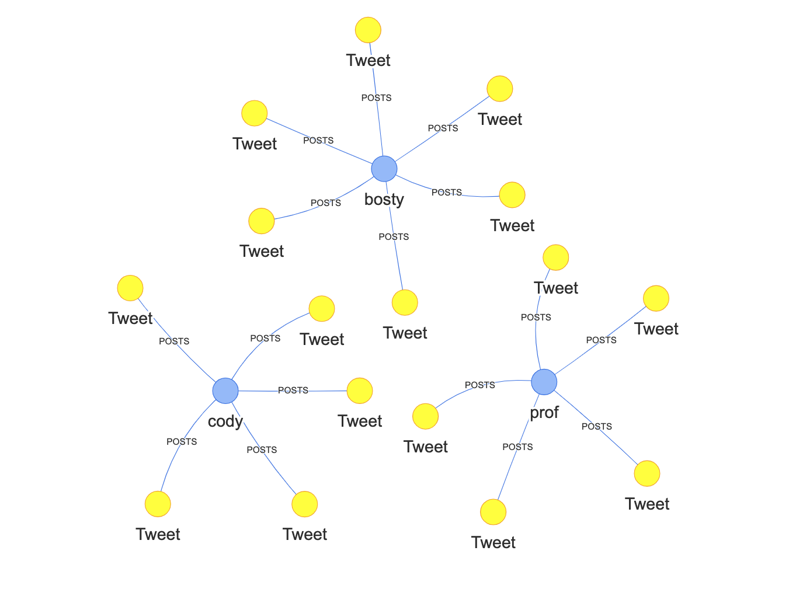
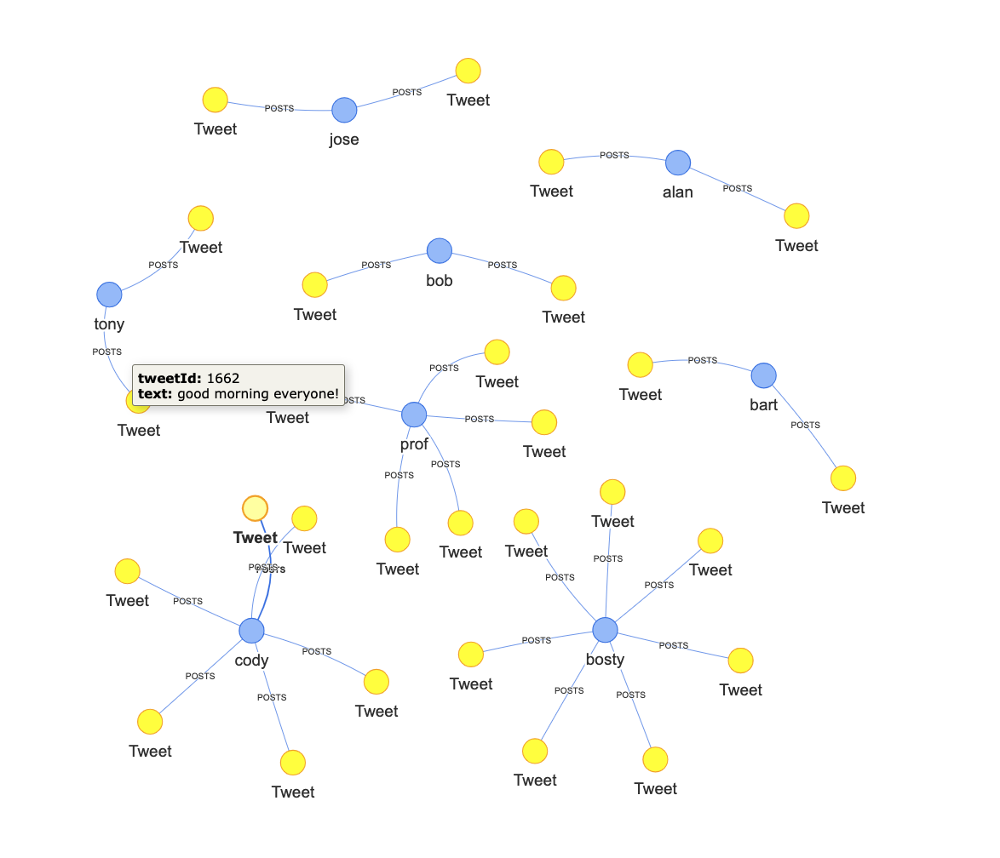

# Social Grapher ([Youtube Demo](https://youtu.be/leRvagxmJus))

A web app to visualize social media activity. In this app, the user can create a new 'tweet' and the data will be stored in our Neo4j database. The component will then re-render the graph with the newly added 'tweet', along with the added relations (POSTS)

## Tech Stack

- Typescript
- React (w/ Hooks)
- Express
- Apollo (server & client)
- Neo4j
- GraphQL
- Neovvis (Neo4j JS visualization library)

## Example Graph visualizations

&nbsp;

 few users and tweets 

&nbsp;

 Many users and tweets! 

